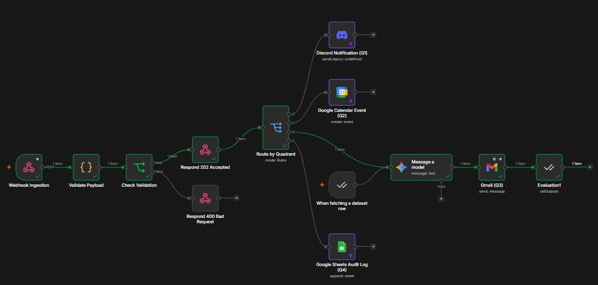
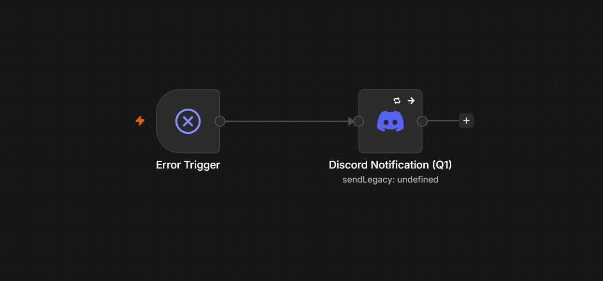

# 🚀 EisenFlow: Eisenhower Matrix Task Orchestrator (v2.0)

[](https://n8n.io)
[](https://deepmind.google/technologies/gemini/)
[](https://www.docker.com/)

**EisenFlow** es un sistema automatizado de orquestación y clasificación de tareas basado en la **Matriz de Eisenhower**. Recibe tareas en tiempo real mediante un Webhook, valida su integridad, y las enruta inteligentemente a su cuadrante correspondiente (Hacer, Programar, Delegar o Eliminar) interactuando con diversas APIs de productividad, potenciado con Inteligencia Artificial y protegido por un manejador global de errores.

---

## 🌟 Características Clave

- ⚡ **Ingesta Eficiente:** Webhook de entrada con respuesta asíncrona `202 Accepted` y validación estricta de esquemas (JSON con estructura e IDs en formato UUIDv4).
- 🔀 **Enrutamiento Dinámico:** Distribución precisa de tareas según su urgencia e importancia (Cuadrantes Q1 a Q4).
- 🤖 **Redacción con IA (Gemini 2.5 Flash):** Redacción automatizada de correos formales de delegación de tareas (Q3) optimizada con el modelo nativo Google Gemini.
- 📊 **Framework de Evaluaciones (AI Evaluation Loop):** Sistema de pruebas automatizadas integrado en n8n que lee un dataset de prueba desde Google Sheets, ejecuta el flujo, evalúa las salidas del modelo de IA y registra los resultados de vuelta en el dataset.
- 🛡️ **Tolerancia a Fallos:** Reintentos automáticos configurados en todos los nodos externos (`exponentialBackoff` y `linearBackoff`) para asegurar que una falla temporal de API no rompa la ejecución.
- 🚨 **Gestión Global de Errores (Error Handler):** Integración nativa con un workflow secundario de excepciones que notifica alertas de fallos en producción directamente a un canal de **Discord**.

---

## 📂 Estructura del Proyecto

El repositorio está organizado de la siguiente manera:

```text
n8n_eisenflow/
├── .env.example
├── .gitignore
├── README.md
├── workflows/                      # Flujos de n8n en formato JSON
│   ├── eisenhower_matrix_task_orchestrator_v2.json
│   └── eisenflow_error_handler.json
├── docs/                           # Documentación detallada
│   ├── technical_guide.md          # Guía de configuración, credenciales y pruebas
│   ├── self_hosting.md             # Guía de despliegue auto-hospedado en Docker
│   └── agents_guide.md             # Guía de integración de agentes MCP locales
└── tests/                          # Datasets y recursos de pruebas
```

---

## 📐 Flujo e Integración por Cuadrante

```
       [ WEBHOOK INGESTION ] 
                 │
        [ VALIDATE PAYLOAD ]
                 │
       [ ROUTE BY QUADRANT ]
      ┌──────────┼──────────┬──────────┐
      ▼          ▼          ▼          ▼
   ┌──────┐   ┌──────┐   ┌──────┐   ┌──────┐
   │  Q1  │   │  Q2  │   │  Q3  │   │  Q4  │
   │Hacer │   │Prog. │   │Deleg.│   │Elim. │
   └──┬───┘   └──┬───┘   └──┬───┘   └──┬───┘
      ▼          ▼          ▼          ▼
   [Discord]  [Google     [Gemini    [Google
   Channel]   Calendar]     &        Sheets]
                          Gmail]
                            │
                      (Evaluations)
                            ▼
                     [Google Sheets]
```

1. **Q1: Hacer (Urgente e Importante) 🔴** -> Envía notificaciones de alerta inmediata a un canal de **Discord**.
2. **Q2: Programar (No Urgente pero Importante) 🟡** -> Programa automáticamente un bloque de tiempo de 1 hora en **Google Calendar** para realizar la tarea.
3. **Q3: Delegar (Urgente pero No Importante) 🔵** -> **Google Gemini (2.5 Flash)** redacta de manera concisa el cuerpo de un correo formal delegando la tarea, el cual se envía automáticamente a través de **Gmail**.
4. **Q4: Eliminar (No Urgente y No Importante) 🟢** -> Registra la tarea en una bitácora o log de auditoría en **Google Sheets** para su posterior archivo o eliminación.

---

## 📸 Capturas de Pantalla

### 1. Flujo de Trabajo Principal
Vista general de la orquestación y enrutamiento inteligente de tareas en n8n:


### 2. Manejador Global de Errores
El flujo de captura automatizada de excepciones y notificaciones instantáneas a Discord:


---

## 🚨 Manejador de Errores (Error Handler)

El proyecto incluye el archivo [eisenflow_error_handler.json](workflows/eisenflow_error_handler.json). Este flujo actúa como un capturador centralizado de errores.

### Cómo Configurarlo:
1. **Importa** el archivo [eisenflow_error_handler.json](workflows/eisenflow_error_handler.json) en n8n como un nuevo flujo independiente llamado `EisenFlow - Error Handler` y **actívalo**.
2. Abre tu flujo principal `Eisenhower Matrix Task Orchestrator V2`.
3. Ve a la configuración de la esquina superior derecha (⚙️ **Settings**).
4. En el menú desplegable de **Error workflow**, selecciona `EisenFlow - Error Handler`.
5. Guarda y activa el flujo.
*Cualquier fallo futuro enviará detalles en tiempo real (nombre del workflow, último nodo ejecutado y mensaje de error) directamente a tu canal de Discord.*

---

## ⚙️ Configuración del Entorno

1. Copia el archivo de plantilla `.env.example` como un archivo `.env`:
   ```bash
   cp .env.example .env
   ```
2. Rellena las variables de entorno correspondientes con tus identificadores y IDs de credenciales de n8n:
   - Discord Token y IDs de canal.
   - Cuenta de Google Calendar y Spreadsheet IDs.
   - Credenciales SMTP/OAuth de Gmail y API Key de Google Gemini.

---

## 🐳 Despliegue en Docker (Self-Hosted)

Para levantar la instancia de n8n en Docker, asegúrate de estar utilizando una versión compatible con el framework de **Evaluaciones**.

Ejecuta el siguiente comando para levantar tu entorno:
```bash
docker run -d --name n8n -p 5678:5678 -v n8n_data:/home/node/.n8n docker.n8n.io/n8nio/n8n:latest
```

---

## 🧪 Cómo probar el Workflow

### Envío de Tarea mediante Webhook
Puedes enviar una petición `POST` al Webhook de pruebas en la ruta `/webhook-test/eisenhower/tasks` utilizando `curl`:

```bash
curl -X POST http://localhost:5678/webhook-test/eisenhower/tasks \
  -H "Content-Type: application/json" \
  -d '{
    "id": "7a35e890-482a-4df3-b82c-dc8c34f3c054",
    "titulo": "Actualizar el dashboard de ventas semanales",
    "cuadrante": "Q3"
  }'
```

### Ejecutar Suite de Evaluaciones (Pruebas Unitarias de IA)
1. Conecta el disparador de evaluación al dataset de Google Sheets `EisenFlow - Evaluation Dataset` (hoja `Q3 - Gemini Tests`).
2. Dirígete a la pestaña **Evaluations** en el editor de n8n.
3. Haz clic en **Run** para ejecutar las pruebas automatizadas. Esto validará la respuesta generada por Gemini y la escribirá automáticamente en tu Google Sheet en la columna `generated_email`.

---

## 🖥️ Interfaz de Usuario (eisenflow-core)

Este workflow de n8n se integra directamente con el ecosistema de la aplicación [eisenflow-core](https://github.com/ingwplanchez/eisenflow-core), la cual provee la interfaz gráfica de usuario.

### Características de la Integración:
- **Tecnología:** Backend desarrollado en **FastAPI** para la gestión y panel de tareas.
- **Flujo de Trabajo:** La aplicación web permite a los usuarios crear y organizar tareas visualmente. Al guardar una tarea, el backend realiza un envío HTTP `POST` automático hacia el webhook de n8n (`/eisenhower/tasks`) con el payload validado.
- **Instrucciones de Uso:**
  1. Configura y levanta el repositorio [eisenflow-core](https://github.com/ingwplanchez/eisenflow-core).
  2. Modifica la variable de entorno de la URL del webhook de n8n en el archivo `.env` del frontend/FastAPI para que apunte a tu instancia activa de n8n.
  3. Al registrar una tarea desde la interfaz de usuario, n8n la procesará en tiempo real en base a la matriz de Eisenhower.

---

## 📚 Documentación Adicional
Para ver detalles a fondo sobre las configuraciones técnicas de cada nodo, tolerancias a fallos y solución de problemas, consulta la [Guía Técnica de EisenFlow](docs/technical_guide.md).

