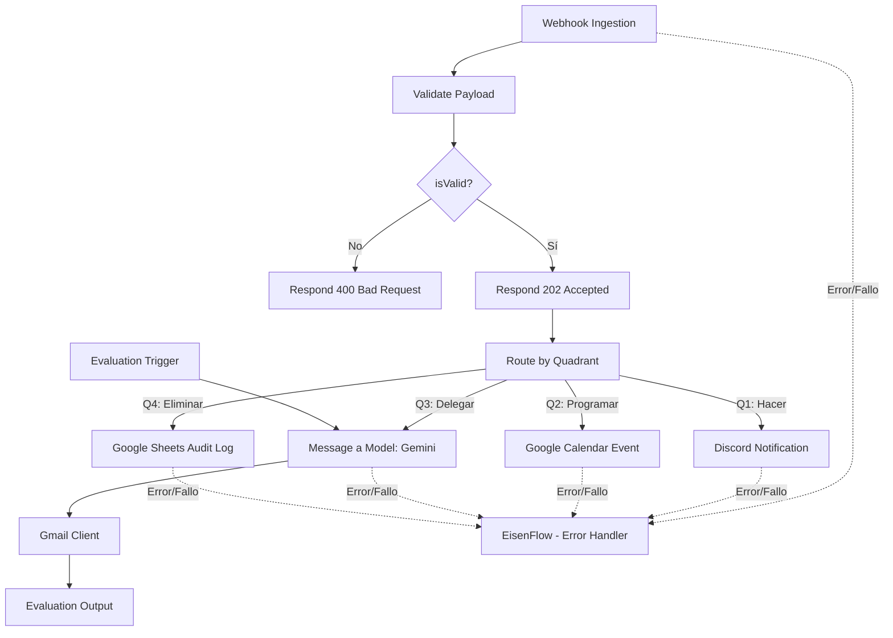

# Eisenhower Matrix n8n – Guía Técnica (v2.0)

Este documento describe la **arquitectura**, **configuración de nodos**, **credenciales**, **gestión de errores** y el **framework de evaluaciones** del workflow de n8n para la automatización e inteligente orquestación de tareas basadas en la matriz de Eisenhower.

---

## 📖 Arquitectura del Workflow

El flujo procesa payloads entrantes, los valida estructuradamente y los enruta automáticamente a cuatro destinos dependiendo del cuadrante de la matriz de Eisenhower asignado a la tarea:



---

## ⚙️ Configuración del Flujo y Nodos

### 1️⃣ Ingesta e Integridad de Datos

#### Webhook Ingestion
- **Método HTTP**: `POST`
- **Path**: `eisenhower/tasks`
- **Respuesta**: `responseNode` (delegado para dar respuestas personalizadas basadas en validación).

#### Validate Payload (Node Code - JavaScript)
Valida la estructura del payload antes de procesarla. Requiere:
- Un `id` en formato UUIDv4.
- Un `titulo` no vacío.
- Un `cuadrante` estrictamente igual a `Q1`, `Q2`, `Q3` o `Q4`.

#### Check Validation (Node IF)
Valida si el paso de código anterior retornó `isValid: true` o `false`, enrutando a:
- **Respond 202 Accepted**: En caso de éxito. Retorna un JSON de confirmación al cliente y continúa el procesamiento asíncrono.
- **Respond 400 Bad Request**: En caso de error. Retorna el detalle del fallo y detiene el flujo.

---

### 2️⃣ Destinos por Cuadrante (Route by Quadrant)

El nodo **Switch** evalúa el valor de `{{ $json.cuadrante }}`:

#### 🔴 Q1 (Urgente e Importante) → Discord Notification
- **Descripción**: Envía una alerta inmediata a un canal de Discord indicando una tarea de alta prioridad.
- **Mensaje**:
  ```markdown
  🚨 **Nueva Tarea Eisenhower - Alta Prioridad (Q1: Hacer)**
  **ID**: {{ $json.id }}
  **Tarea**: {{ $json.titulo }}
  **Cuadrante**: {{ $json.cuadrante }} (Urgente e Importante)
  ```
- **Tolerancia a fallos**: 5 reintentos automáticos separados por 5 segundos.

#### 🟡 Q2 (No Urgente pero Importante) → Google Calendar Event
- **Descripción**: Agenda un bloque de tiempo de 1 hora en Google Calendar para trabajar en la tarea.
- **Inicio**: `{{ $now.toISO() }}`
- **Fin**: `{{ $now.plus({ hours: 1 }).toISO() }}`
- **Título**: `Planificar: {{ $json.titulo }}`
- **Tolerancia a fallos**: 5 reintentos separados por 5 segundos.

#### 🔵 Q3 (Urgente pero No Importante) → Inteligencia Artificial (Gemini) y Gmail
- **Modelo de IA**: `Google Gemini` (`gemini-2.5-flash`)
- **Descripción**: Redacta y envía de forma automática un correo electrónico delegando la tarea.
- **Prompt del Sistema / Mensaje**:
  ```text
  Redacta un correo formal de delegación de la siguiente tarea: "{{ $json.titulo }}". El correo debe ser profesional, conciso y solicitar al receptor que se haga cargo de la misma debido a que es urgente pero no requiere mi atención directa. Devuelve únicamente el cuerpo del correo sin saludos genéricos de plantilla ni firmas vacías.
  ```
- **Envío**: Nodo de **Gmail** que despacha el texto generado por Gemini a la dirección configurada.
- **Tolerancia a fallos**: 5 reintentos separados por 5 segundos.

#### 🟢 Q4 (No Urgente y No Importante) → Google Sheets Audit Log
- **Descripción**: Registra la tarea a eliminar/archivar en una hoja de cálculo para auditoría.
- **Hoja**: Archivo `n8n-eisenhower-eliminar`, pestaña `Eliminar`.
- **Columnas**: `ID` (`{{ $json.id }}`), `Tarea` (`{{ $json.titulo }}`), `Fecha` (`{{ $now.format('DD') }}`).
- **Tolerancia a fallos**: 5 reintentos separados por 5 segundos.

---

## 🚨 Gestión Global de Errores (Error Handler)

Para asegurar la robustez del sistema en producción, se utiliza el flujo secundario de control de errores [eisenflow_error_handler.json](../workflows/eisenflow_error_handler.json).

### Funcionamiento
1. **Error Trigger**: Este nodo captura de forma activa cualquier excepción no controlada o fallo definitivo en el flujo principal (`Eisenhower Matrix Task Orchestrator V2`).
2. **Discord Alert**: Envía una notificación formateada a tu canal de Discord de administración notificando el incidente para que actúes de inmediato.
   - **Mensaje enviado**:
     ```text
     ⚠️ Error en EisenFlow
     Workflow: {{ $json.workflow.name }}
     Nodo: {{ $json.execution.lastNodeExecuted }}
     Error: {{ $json.execution.error.message }}
     ```

### Cómo Vincular el Manejador de Errores:
1. **Importar**: En n8n, crea un nuevo workflow e importa el archivo [eisenflow_error_handler.json](../workflows/eisenflow_error_handler.json). Actívalo.
2. **Configurar el flujo principal**:
   - Abre el flujo principal `Eisenhower Matrix Task Orchestrator V2`.
   - Haz clic en el icono de engranaje (⚙️ **Settings**) en la parte superior derecha.
   - En la opción **Error workflow**, selecciona del buscador el flujo `"EisenFlow - Error Handler"`.
   - Guarda los cambios (Ctrl+S).

---

## 🧪 Evaluaciones y Pruebas Continuas (AI Evaluations)

El flujo cuenta con un **Evaluation Loop** integrado en n8n para auditar y evaluar la calidad de las respuestas redactadas por Gemini en el cuadrante Q3.

### Estructura de Datos (Dataset de Prueba)
- **Origen**: Google Sheets (`EisenFlow - Evaluation Dataset` / Pestaña: `Q3 - Gemini Tests`)
- **Columnas**:
  - `id`: Identificador del caso de prueba.
  - `titulo`: Tarea de prueba.
  - `cuadrante`: Siempre `Q3`.
  - `expected_keywords`: Palabras clave esperadas en la respuesta de la IA.
  - `generated_email` *(Salida)*: Columna donde se escribe el resultado generado por la IA para su revisión.

### Nodos de Evaluación del Flujo:
1. **When fetching a dataset row (Evaluation Trigger)**:
   Inicia la ejecución de pruebas unitarias tomando fila por fila del Google Sheet y enviando el `titulo` al nodo de Gemini.
2. **Evaluation1 (Set Outputs)**:
   Captura la salida final generada por Gemini (`{{ $('Message a model').item.json.content.parts[0].text }}`) y la inserta de vuelta en la columna `generated_email` del dataset de Google Sheets.

---

## 🛡️ Solución de Problemas Comunes

| Síntoma | Posible Causa | Acción Recomendada |
| :--- | :--- | :--- |
| **Error 400 Bad Request** | Formato de Payload incorrecto o UUID inválido. | Verifica que el JSON enviado use UUIDv4 (`123e4567-e89b-12d3-a456-426614174000`). |
| **Error de Autenticación de Google** | Refresh token de OAuth expirado. | Ve al menú de credenciales en n8n y vuelve a conectar tu cuenta de Google. |
| **Falta de opción "Tables"** | Versión de n8n desactualizada. | Asegúrate de usar la última imagen de Docker para n8n (`docker pull docker.n8n.io/n8nio/n8n:latest`). |
| **Las evaluaciones no escriben resultados** | Falta mapeo en el nodo de salida o permisos del Sheet. | Abre el nodo `Evaluation1`, verifica que la ruta de origen apunta a `generated_email` y que tu cuenta tiene permisos de edición. |
