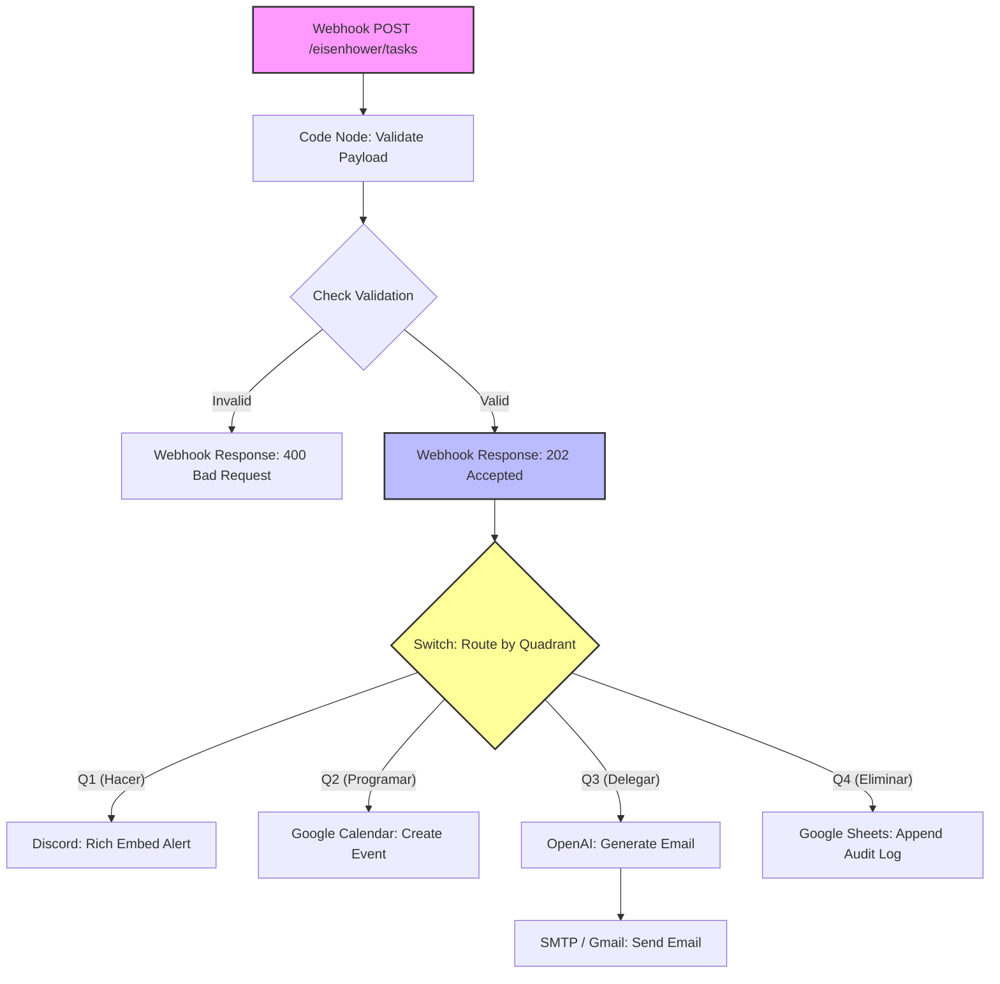

# Plan de Implementación: Motor de Orquestación n8n con Matriz de Eisenhower

Este plan detalla el diseño técnico y los pasos para implementar un flujo de trabajo en n8n que actúe como un despachador de eventos asíncrono y tolerante a fallos, utilizando la Matriz de Eisenhower.

## User Review Required

> [!IMPORTANT]
> **Configuración de Credenciales**:
> El flujo de trabajo asume la existencia de credenciales preconfiguradas para los servicios de terceros:
> - **Slack / Discord**: Requiere una URL de Webhook de Discord o token de Slack.
> - **Google Calendar**: Requiere autenticación OAuth2 de Google.
> - **OpenAI (AI Email Writer)**: Requiere una API Key de OpenAI para el procesamiento de lenguaje natural.
> - **SMTP / Gmail**: Requiere credenciales de servidor de correo para enviar las tareas delegadas.
> - **Google Sheets**: Requiere autenticación OAuth2 de Google para auditar las tareas descartadas.
>
> Para asegurar que el flujo sea importable sin errores críticos, se utilizarán las definiciones de nodos estándar con propiedades parametrizadas. Las políticas de reintento (`Retry On Failure`) y manejo de errores se configurarán nativamente.

## Proposed Changes

Crearemos el archivo JSON del flujo de trabajo en la raíz del proyecto para que pueda ser copiado e importado directamente en el canvas de n8n.

### [NEW] [eisenhower_matrix_orchestrator.json](file:///c:/Users/USER/Documents/wplanchez/Portafolio/Repositorios/N8N/n8n_eisenflow/eisenhower_matrix_orchestrator.json)

Archivo JSON que contiene la estructura completa del flujo de trabajo. La arquitectura consta de:



### Detalles Técnicos de los Nodos

1. **Webhook Ingesta**:
   - URL Path: `eisenhower/tasks`
   - Método: `POST`
   - Response Mode: `responseNode` (delegado al nodo Webhook Response).
   - Estructura esperada:
     ```json
     {
       "id": "UUIDv4",
       "titulo": "string",
       "cuadrante": "Q1 | Q2 | Q3 | Q4"
     }
     ```

2. **Validate Payload (Code Node)**:
   - Valida el payload de forma sintáctica y estructural.
   - Aplica expresión regular para UUIDv4 y valida que el cuadrante pertenezca al conjunto `{Q1, Q2, Q3, Q4}`.

3. **Check Validation (IF Node)**:
   - Evalúa `{{ $json.isValid }}`.
   - **Falso**: Conecta a un nodo `Respond to Webhook` con estado `400` y el detalle de errores.
   - **Verdadero**: Conecta a un nodo `Respond to Webhook` con estado `202` y cuerpo `{"status": "accepted", "id": "{{ $json.id }}"}`.

4. **Switch Quadrant (Switch Node)**:
   - Conectado a la salida del Webhook Response de éxito.
   - Evalúa la expresión `{{ $json.cuadrante }}`.
   - Genera 4 salidas mutuamente excluyentes (`Q1`, `Q2`, `Q3`, `Q4`).

5. **Rama Q1 (Hacer)**:
   - Integración con Discord/Slack.
   - Envía un Rich Embed o Block Kit formateado con el `id` y `titulo`.
   - Reintentos: Backoff exponencial activado.
   - Tolerancia a fallos: `Continue On Fail = true`.

6. **Rama Q2 (Programar)**:
   - Integración con Google Calendar.
   - Mapea `titulo` al resumen del evento.
   - Mapea hora inicio como `{{ $now.toISO() }}` y fin como `{{ $now.plus({ hours: 1 }).toISO() }}`.
   - Reintentos y tolerancia a fallos activados.

7. **Rama Q3 (Delegar)**:
   - OpenAI Node: Utiliza GPT-4o o GPT-3.5-turbo para redactar un correo formal de delegación.
   - SMTP Send Node: Envía el cuerpo de correo generado al destinatario correspondiente.
   - Reintentos y tolerancia a fallos activados.

8. **Rama Q4 (Eliminar)**:
   - Google Sheets Node: Inserta una fila en modo Append en la hoja "Tareas Descartadas".
   - Columnas: `id`, `titulo`, `timestamp` (`{{ $now.toISO() }}`).
   - Reintentos y tolerancia a fallos activados.

## Verification Plan

### Automated Tests
Puesto que no podemos interactuar en vivo con servicios de terceros sin tokens reales, utilizaremos simuladores y validación sintáctica:
- Validar la configuración sintáctica del archivo JSON generado mediante las herramientas de n8n MCP si es posible.
- Validar el código de validación del payload utilizando Node.js localmente en el workspace.

### Manual Verification
1. Copiar el JSON generado y pegarlo directamente en el canvas de n8n (`Ctrl+V`).
2. Levantar el flujo en modo "Test".
3. Probar usando `curl` o Postman con payloads válidos e inválidos:
   ```bash
   # Prueba 1: Payload Válido (Q1)
   curl -X POST http://localhost:5678/webhook-test/eisenhower/tasks \
     -H "Content-Type: application/json" \
     -d '{"id": "6ba7b810-9dad-11d1-80b4-00c04fd430c8", "titulo": "Resolver bug crítico en producción", "cuadrante": "Q1"}'

   # Prueba 2: Payload Inválido (Falta id)
   curl -X POST http://localhost:5678/webhook-test/eisenhower/tasks \
     -H "Content-Type: application/json" \
     -d '{"titulo": "Revisar correo", "cuadrante": "Q2"}'
   ```
4. Confirmar que se recibe respuesta inmediata `202 Accepted` para peticiones válidas y `400 Bad Request` para las inválidas, mientras la ejecución de la rama continúa de fondo.
